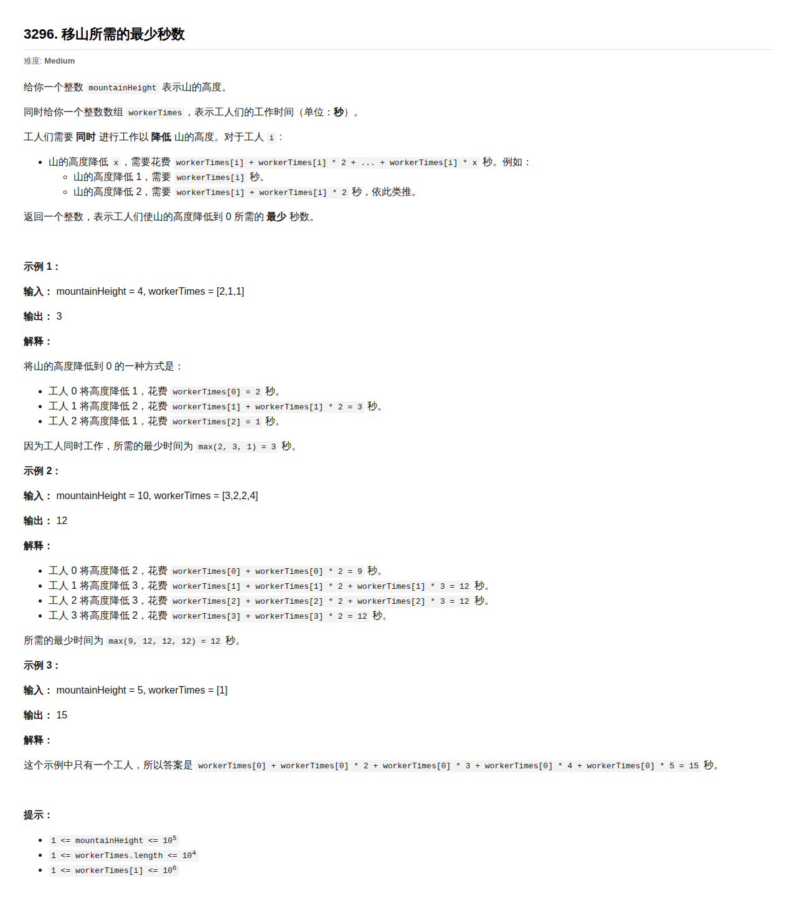

# [3296. 移山所需的最少秒数](https://leetcode.cn/problems/minimum-number-of-seconds-to-make-mountain-height-zero/)

**2026-03-13**

**题目难度：Medium** 



---

## 思路 

---

## 代码实现 (C++)
```cpp

```

- 时间复杂度: $O()$
- 空间复杂度: $O()$

---

